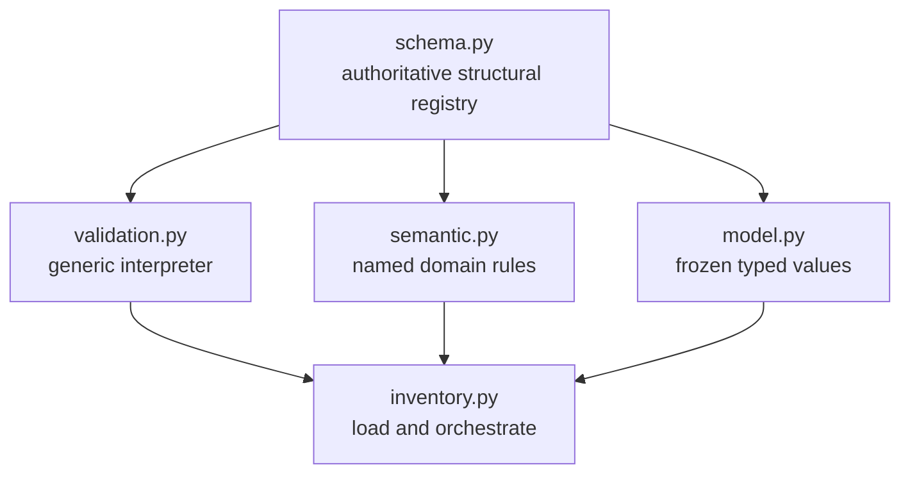
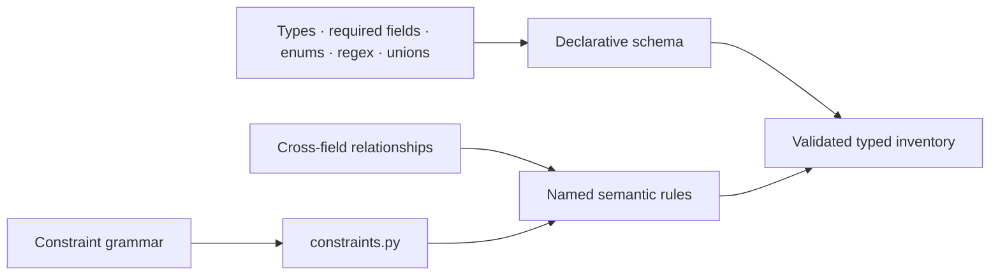
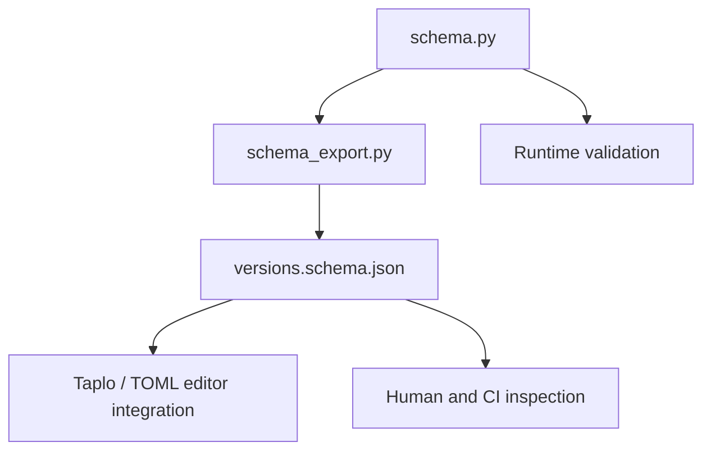

## Context

`manage-docker-toolchain-versions` establishes `docker-constructor.toml`, immutable typed inventory models, and local validation in `docker/versioning/inventory.py`. Its structural schema is currently encoded in several imperative mechanisms: allowed-key registries, source/update dispatch, entry-specific class maps, repeated path traversal, version-format functions, and model constructors. Those mechanisms are tested, but the accepted TOML format has no single inspectable description and cannot directly power editor tooling.

This change follows the inventory contract after Stage 1/1A of `manage-docker-toolchain-versions` is stable. Runtime inventory validation must remain Python 3.11+ standard-library-only, offline, deterministic, and compatible with the existing public resolver errors and typed models.

## Goals / Non-Goals

**Goals:**

- Make one declarative Python registry authoritative for structural inventory shape.
- Interpret that registry generically to validate parsed TOML and construct immutable typed values.
- Keep cross-field and domain-language behavior in small named semantic rules.
- Generate deterministic JSON Schema Draft 2020-12 for documentation and editor tooling.
- Detect drift between the registry, generated artifact, model constructors, and validation fixtures.
- Preserve accepted production inventory, actionable dot-path diagnostics, and resolver interfaces.

**Non-Goals:**

- Implement a complete JSON Schema interpreter in the runtime.
- Introduce Pydantic, `jsonschema`, CUE, or another runtime dependency.
- Encode arbitrary expressions or the version-constraint language in the structural schema DSL.
- Change selected versions, source/update providers, override policy, Docker arguments, or update discovery.
- Make the generated JSON Schema authoritative over the Python registry.

## Decisions

### Use a deliberately small standard-library Python schema DSL

Add `docker/versioning/schema.py` containing immutable schema nodes for the features the inventory actually needs: primitive types, constants, enums, regex strings, lists, closed tables, dynamic maps, references, and tagged unions. Table nodes declare required and optional fields, reject additional properties by default, identify their output factory, and list named semantic rules.

The DSL is data rather than path-specific control flow. It SHALL not gain arbitrary callbacks for ordinary structural checks; new structural behavior requires a reusable schema node with focused tests.

A Python registry is preferred over handwritten JSON Schema because it preserves standard-library runtime validation and can carry typed model factories without maintaining a second mapping. Pydantic would reduce custom code but adds a substantial runtime dependency. CUE is more expressive but adds a mandatory external tool. A documentation-only schema would leave two independent definitions that can drift.

### Separate structural validation from semantic rules

`validation.py` recursively interprets schema nodes and owns:

- required and optional fields;
- primitive and container types;
- constants, enums, and string patterns;
- closed-table unknown-key rejection;
- tagged source/update variants;
- dynamic extension and artifact maps;
- stable dot-path diagnostics;
- model-factory invocation after child values validate.

`semantic.py` owns named rules that inherently compare fields or invoke domain parsers:

- source tag equals selected version;
- artifact URL corresponds to selected version;
- Rust manifest corresponds to selected Rust version;
- source/update pair is valid for an entry;
- required platforms exist in artifacts;
- override constraints are syntactically consistent;
- exact default satisfies its override policy;
- checksums are not placeholders where a plain pattern is insufficient.

Constraint parsing and consistency remain in `constraints.py`. Semantic rule names are declared by schema nodes and resolved through a closed registry. Unknown rule names fail during schema self-validation.

### Keep schema self-validation explicit

Before validating inventory data, tests and developer checks validate the schema registry itself. Self-validation confirms unique definition names, resolvable references, valid tagged-union discriminators, known semantic rules, factory compatibility, and deterministic definition ordering.

Model dataclasses remain the runtime API. A schema/model consistency check compares declared output fields with dataclass constructor fields so structural and typed definitions cannot silently diverge.

### Generate, do not hand-maintain, JSON Schema

Add `docker/versioning/schema_export.py` to map the supported DSL nodes to JSON Schema Draft 2020-12. The checked-in `versions.schema.json` is generated, deterministic documentation. Standard constructs represent structural behavior; named rules that JSON Schema cannot faithfully express are emitted as informational `x-semantic-rules` annotations.

The stable developer interface is exposed through the resolver after its CLI exists:

- `python3 docker/versions.py schema` writes canonical JSON to stdout;
- `python3 docker/versions.py schema --check` compares generated bytes with the checked-in file without mutation;
- `python3 docker/versions.py schema --write` explicitly refreshes `versions.schema.json`.

Identical registry input produces byte-identical UTF-8 JSON with stable key ordering and a final newline. Generation contains schema constraints and descriptions but no selected version, URL, revision, or digest copied from `docker-constructor.toml`.

### Preserve validation behavior through characterization and differential tests

Existing valid and invalid fixtures form the compatibility corpus. Before replacing imperative traversal, tests run both validators against the corpus and compare success/failure, exception family, and actionable path. New schema-specific fixtures cover self-validation failures and each reusable node.

After parity is demonstrated, `inventory.py` delegates structural work to the generic interpreter and retains only TOML parsing, semantic orchestration, and public API adaptation. Obsolete key registries and duplicated entry dispatch are removed rather than retained as fallback schema sources.

### Keep generated-schema validation optional

Runtime correctness comes from the stdlib interpreter, not from importing `jsonschema`. CI MAY additionally run a standards-based checker when available, but required local tests and ordinary resolver commands SHALL not depend on it, Docker, or network access.

## Risks / Trade-offs

- [The custom DSL grows into a proprietary general schema language] → Support only inventory-required reusable nodes and keep domain relationships in named rules.
- [Generated JSON Schema appears more authoritative than it is] → Mark it generated, identify `schema.py` as authoritative, and expose semantic limitations through `x-semantic-rules`.
- [Structural and model definitions drift] → Self-validate factory signatures and run schema/model consistency tests.
- [Migration changes error text or acceptance unexpectedly] → Use differential fixture tests before removing imperative validation and preserve exception families and paths.
- [Editor validation cannot enforce semantic rules] → Document that editor feedback is structural and that `versions.py validate` remains authoritative.
- [Schema generation introduces repository churn] → Require deterministic output and a non-mutating `--check` gate.

## Migration Plan

1. Characterize the current validator with valid/invalid fixtures and capture path/error-family expectations.
2. Add schema nodes, self-validation, and generic interpreter without switching production loading.
3. Describe all current inventory entries and providers in the registry and prove differential parity.
4. Move cross-field checks behind named semantic rules and switch `inventory.py` to the new path.
5. Remove obsolete imperative structural registries and dispatch.
6. Add deterministic JSON Schema generation, check in the generated artifact, and document editor association.
7. Run offline suites and the real `docker-constructor.toml` validation before downstream resolver stages continue.

Rollback is a source revert to the prior inventory validator; `docker-constructor.toml` and public model shapes do not require data migration.

## Open Questions

- Which editor configuration files, if any, should be checked in for automatic TOML-to-schema association versus documenting user-local Taplo/VS Code configuration?
- Should schema descriptions be authored directly on every DSL node initially, or added only for public entry/provider definitions to limit boilerplate?
