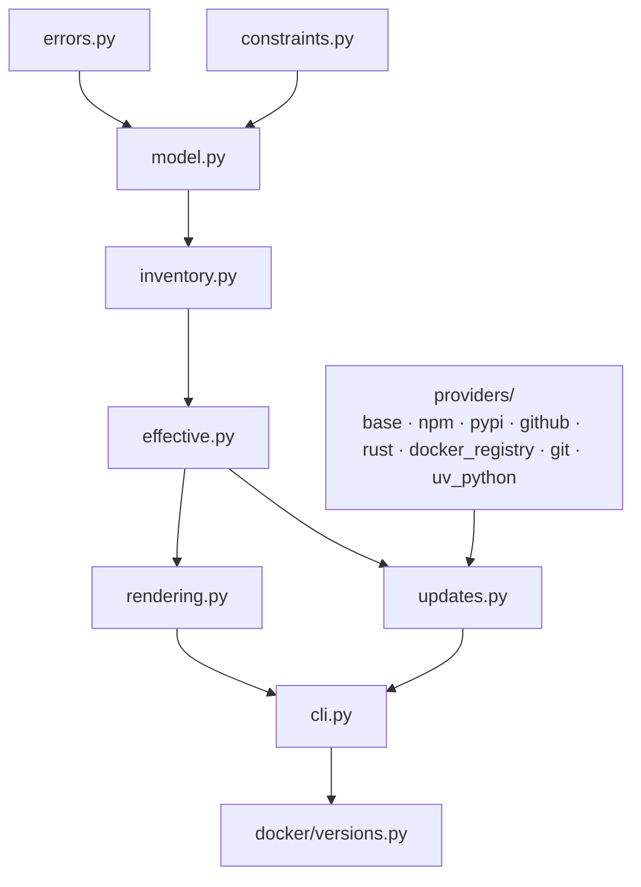

## Context

Version data is duplicated across `Dockerfile`, `docker-compose.yml`, `docker/verify-runtime.sh`, and `docker/install-pi-extensions.sh`. Dockerfiles cannot parse TOML before `FROM`, so a host-side resolver is required to turn reviewed configuration into build arguments. Runtime scripts also need access to the effective values rather than maintaining separate expected-version constants.

The completed `split-rtk-fd-prebuilt` and `pin-pi-read-npm` changes remain authoritative for artifact installation and mounted-home extension setup. This change centralizes their selected values and focuses implementation on the remaining moving inputs and common configuration plumbing.

## Goals / Non-Goals

**Goals:**

- Make `versions.toml` the reviewed source of default versions, revisions, URLs, digests, platform artifacts, and update metadata.
- Validate inventory structure and semantic constraints without network access.
- Provide a canonical build launcher that passes effective values to Docker/Compose.
- Make effective version information inspectable in the image and consumable by runtime scripts.
- Discover stable updates on demand without affecting normal builds.
- Print reviewable update suggestions without modifying files.

**Non-Goals:**

- Automatically applying upgrades.
- Making ordinary Docker builds depend on GitHub, npm, PyPI, or registry update APIs beyond downloading selected build artifacts.
- Producing byte-identical OCI images or freezing Debian repositories.
- Reimplementing prebuilt `rtk`/`fd` stages or Pi extension setup.

## Decisions

### Structure the inventory by dependency/cache scope

Use TOML sections corresponding to build graph nodes: `base`, `toolchain`, `rtk-prebuilt`, `fd-prebuilt`, `pi-tools`, `openspec-tools`, `runtime`, and `runtime.pi-extensions`. Platform-specific release artifacts include URL and SHA-256 together so a version cannot be reviewed independently from its bytes.

Every independently selected version or revision includes explicit source and update metadata. Installation mechanism does not substitute for provenance: `ty` uses a PyPI source/provider, each Pi extension uses its npm package as the source and the npm provider, and uv-managed CPython uses a dedicated `uv-python` source/provider backed by the authoritative interpreter index consumed by uv. The package name is stored only in source metadata for npm and PyPI entries, so runtime extension entries do not duplicate it. Other supported providers include `github-release`, `rust-channel`, `docker-registry`, and `git-ref`. Stable-only policy is explicit for release providers.

Entries are represented as complete typed values in the in-memory inventory; the loader SHALL NOT silently discard declared entries or use catch-all attribute access that makes misspelled paths resolve successfully. Provider-specific fields and source/provider compatibility are validated locally, while provider network access remains exclusive to `check-updates`.

### Decompose the standard-library resolver by responsibility

Keep `docker/versions.py` as the stable, thin executable entry point for `python3 docker/versions.py ...`. Put implementation in a `docker/versioning/` package with acyclic dependency direction:



- `errors.py`: public configuration/CLI exception types and dot-path diagnostics;
- `constraints.py`: dependency-free numeric versions, grammar, matching, and contradiction detection;
- `model.py`: frozen typed inventory, source, update, artifact, and result values;
- `inventory.py`: TOML loading, provider-specific schema validation, cross-field checks, and deterministic traversal;
- `effective.py`: override application and effective-inventory serialization;
- `rendering.py`: Docker/Compose environment and generated build-input rendering;
- `providers/`: one network adapter per provider behind a shared request/result protocol; adapters do not parse CLI arguments or mutate files;
- `updates.py`: provider dispatch, policy filtering, applicability classification, and suggestions;
- `cli.py`: argument parsing, exit-code mapping, output selection, and process orchestration only.

Mirror these boundaries in tests: `test_version_constraints.py`, `test_version_inventory.py`, `test_version_effective.py`, `test_version_rendering.py`, `test_version_updates.py`, provider-specific files under `tests/versioning/providers/`, and subprocess-only `test_versions_cli.py`. Shared TOML builders, fixtures, and fake HTTP transports live under `tests/versioning/support/`; tests SHALL import the owning module rather than reaching through the CLI wrapper. Keep semantic-source and Docker acceptance tests separate because they validate integration rather than resolver units.

Package modules use relative imports. The wrapper supports both direct script execution and package import without `sys.path` mutation, selecting `.versioning.cli` when imported and `versioning.cli` when executed directly.

### Use a Python standard-library resolver

Add `docker/versions.py` using `tomllib`. It provides:

- `validate`: local schema, version syntax, digest length, URL/version consistency, required platform artifact, and Python policy checks;
- `get`: retrieve a single value for scripts;
- `env`: export effective Docker argument values;
- `compose`: launch Docker Compose with validated effective values;
- `check-updates`: query configured providers on demand.

The canonical build path uses `versions.py compose ...`. `build_wrapper.py` delegates version resolution to the same module. `docker-compose.yml` SHALL declare required build-argument names without concrete fallback values and SHALL fail with an actionable message when invoked without resolved values. Direct low-level Compose use may consume `versions.py env`, but neither Compose nor its environment templates may define selected version defaults.

### Preserve controlled overrides through effective configuration

Each overrideable tool keeps an exact reproducible `version` and a separate policy section.

#### Non-normative inventory example

Keep this concrete example in the change design as implementation guidance; the normative specification defines behavior rather than requiring this exact TOML layout.

```toml
[stages.toolchain.python]
version = "3.14.6"

[stages.toolchain.python.source]
type = "uv-python"
implementation = "cpython"

[stages.toolchain.python.update]
provider = "uv-python"
implementation = "cpython"
stable_only = true

[stages.toolchain.python.override]
constraint = ">=3.14.6"
allow_prerelease = false
scheme = "numeric"

[stages.toolchain.ty]
version = "0.0.61"

[stages.toolchain.ty.source]
type = "pypi"
package = "ty"

[stages.toolchain.ty.update]
provider = "pypi"
stable_only = true

[runtime.pi-extensions.pi-read]
version = "0.2.0"

[runtime.pi-extensions.pi-read.source]
type = "npm"
package = "@arcanemachine/pi-read"

[runtime.pi-extensions.pi-read.update]
provider = "npm"
stable_only = true
```

`version` is the exact default selected by a normal build; `constraint` governs deliberate overrides and update candidates. The dedicated `uv-python` provider describes CPython releases available to uv without falsely modeling the interpreter as a PyPI package. npm/PyPI package identity lives in `source.package` and is consumed by installation/rendering code from there. This keeps the minimum and prerelease policy out of Python code while preventing a range from becoming an implicit moving build selection.

Implement a dependency-free restricted constraint grammar for stable numeric versions. Supported clauses are `==`, `>`, `>=`, `<`, and `<=` followed by an `X.Y.Z` value; comma-separated clauses form an AND expression, for example `>=3.14.6,<4.0.0`. Reject unsupported operators, wildcards, OR expressions, omitted components, prerelease/build suffixes when `allow_prerelease=false`, empty clauses, and contradictory constraints. The resolver contains generic parser/evaluator behavior but no tool-specific minimum-version constants.

Supported overrides are applied by `versions.py`, validated against the entry's policy, and represented in an effective inventory. Copy the effective inventory into the image at a root-owned read-only path such as `/usr/local/share/pi-cli/versions.toml`. Runtime verification and `install-pi-extensions.sh` query that inventory through the helper instead of duplicating constants.

### Prohibit version defaults outside the inventory

`versions.toml` SHALL be the only reviewed source of selected default versions, revisions, URLs, and digests. Dockerfile declarations use `ARG NAME` without `=value`; Compose declarations use required interpolation such as `${NAME:?use docker/versions.py compose}`; runtime scripts contain no fallback expected versions. The Node base is passed as a resolved `NODE_BASE_IMAGE=<tag>@<digest>` argument before `FROM`.

Documentation examples SHALL invoke the canonical resolver rather than relying on direct `docker compose build` defaults. Supported overrides are resolver inputs that produce an effective inventory, not independent environment defaults.

### Keep update discovery explicit and best effort

`check-updates` is never invoked by normal build or launch commands. Provider failures are reported as skipped/unavailable in default mode and do not fail solely because an update exists.

Supported output modes include a human-readable table and `--json`. Optional policy flags include `--only`, `--include-prerelease`, `--strict`, and `--fail-on-outdated`.

Default exit semantics:

- `0`: check completed, including when updates are available or a provider was skipped in best-effort mode;
- non-zero: invalid inventory;
- strict/provider and fail-on-outdated modes use distinct documented non-zero codes.

### Make suggestions non-mutating

`check-updates --suggest` prints a TOML fragment or unified proposed values containing the candidate version, matching artifact URL, and published checksum/digest where available. It SHALL NOT edit `versions.toml`, Docker files, lock files, or the working tree.

A candidate is “ready” only when required architecture assets and checksum metadata exist. Incomplete releases are reported but not suggested as directly applicable.

### Distinguish update classes

For Docker images, distinguish a digest refresh of the selected readable tag from a major/channel upgrade. For immutable git refs such as oh-my-zsh, report a newer upstream revision without treating commit hashes as semantic versions.

### Verify effective values

Build/runtime checks execute Node, Rust/Cargo, rustfmt/clippy, uv, Python, ty, Pi, OpenSpec, rtk, and fd version commands and inspect Pi extension package metadata. Assertions compare against the effective inventory, not duplicated shell defaults.

## Risks / Trade-offs

- [The wrapper becomes the canonical build interface] → Keep `env` output available for low-level Compose use and document both paths.
- [Generated effective inventory drifts from actual build arguments] → Produce both from one validated in-memory configuration and verify image values after build.
- [Provider APIs rate-limit checks] → Support best-effort skips, optional token environment variables, and a configurable cache TTL.
- [An upstream release lacks required assets/checksums] → Report it as incomplete and omit it from applicable suggestions.
- [A TOML section mirrors a stage that later moves] → Treat scopes as cache/ownership domains and update the mapping deliberately with graph changes.
- [Pinned inputs delay security updates] → Document regular explicit `check-updates` and reviewed refresh procedures.
