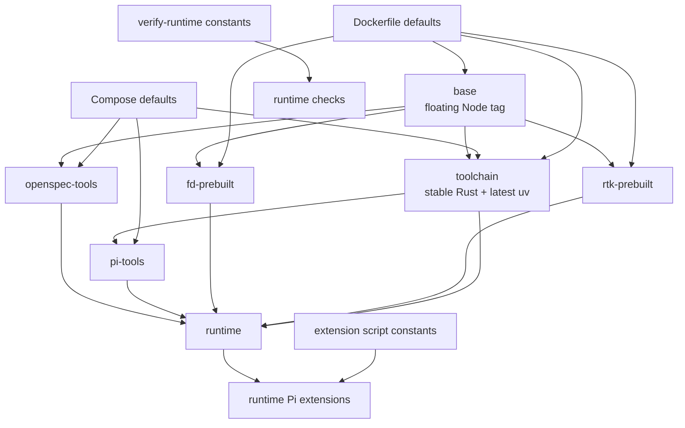
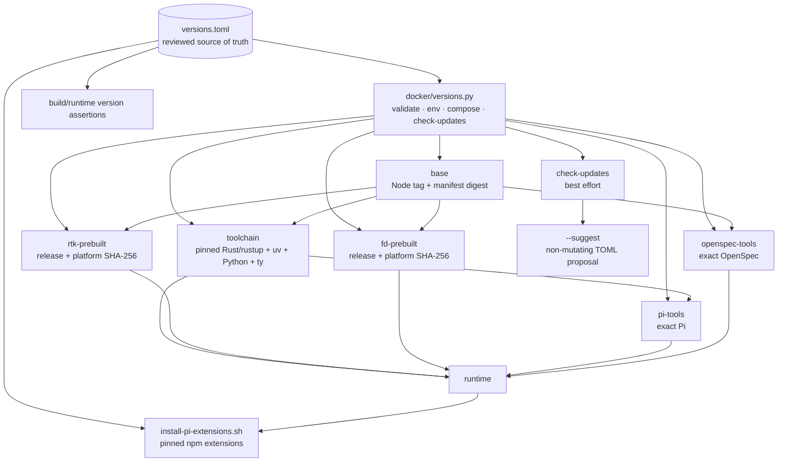

## Why

Tool versions, revisions, artifact URLs, and digests are currently distributed across the Dockerfile, Compose configuration, runtime verification, and extension setup scripts. The completed changes `split-rtk-fd-prebuilt` and `pin-pi-read-npm` pin focused subsets, but the remaining moving inputs and duplicated expected values still allow drift and make reviewed upgrades unnecessarily difficult.

## What Changes

- Add a reviewed `versions.toml` as the single source of default versions, immutable revisions, artifact URLs, architecture-specific digests, and update-provider metadata; every independently selected value has complete source/update provenance, including dedicated `uv-python` metadata for CPython, PyPI metadata for `ty`, and npm metadata for Pi extensions without duplicated package identity.
- Keep `docker/versions.py` as the stable thin command entry point over focused `docker/versioning/` modules that validate the inventory, resolve values, export effective Docker build arguments, launch canonical Compose builds, expose the effective runtime inventory, and isolate provider adapters for offline testing.
- Remove concrete version defaults from `docker-compose.yml`, `Dockerfile`, runtime verification, and extension setup; outside `versions.toml`, configuration may declare required argument names but SHALL NOT duplicate selected values.
- Pin the remaining Node base, Rust/rustup, uv, Python, ty, Pi, OpenSpec, and oh-my-zsh inputs.
- Preserve the authoritative prebuilt `rtk`/`fd` model from `split-rtk-fd-prebuilt` and runtime npm extension model from `pin-pi-read-npm`, moving their selected values into the shared inventory without reimplementing those workflows.
- Add an explicit best-effort `check-updates` operation with provider-specific discovery and a non-mutating `--suggest` mode that prints a reviewable TOML update proposal.
- Preserve the direct Python contract: default exactly `3.14.6`, stable `X.Y.Z` overrides at or above `3.14.6`, no prereleases, no `uv run python`, and no standalone `pip`.
- Add inventory-backed build/runtime assertions and document deliberate refresh procedures.

### Current dependency and configuration graph

### Target dependency and configuration graph

## Capabilities

### New Capabilities

- `docker-build-reproducibility`: Defines the central version inventory, effective build configuration, version validation, update discovery, and controlled refresh policy.

### Modified Capabilities

- `docker-runtime`: Builder/runtime tools and Pi extensions consume and verify the effective shared inventory while preserving their established runtime interfaces.

## Impact

- New `versions.toml`, thin `docker/versions.py` entry point, and modular `docker/versioning/` configuration subsystem.
- Dockerfile, Compose/build wrapper integration, runtime extension setup, version assertions, documentation, and CI checks.
- Network access only for explicit `check-updates`; normal validation and builds remain independent of update-discovery availability.
- No automatic dependency updates: `--suggest` prints proposed values and never edits reviewed source.
