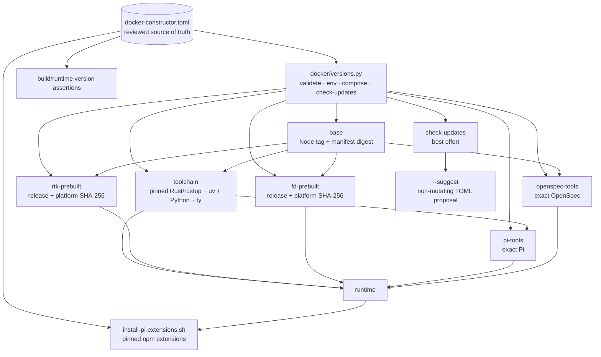

## MODIFIED Requirements

### Requirement: Use a central version inventory
The project SHALL maintain `docker-constructor.toml` as the reviewed source of default non-Debian tool versions, immutable revisions, artifact URLs, platform digests, and update-provider metadata. Every independently selected version or revision SHALL be represented by a complete typed entry with explicit source and update metadata. Effective Docker build arguments and runtime inventory SHALL be derived from the same validated configuration.

The target dependency and configuration graph SHALL remain:

#### Scenario: Validating the inventory locally
- **WHEN** `python3 docker/versions.py validate` runs
- **THEN** it SHALL validate required sections, version syntax, digests, platform artifacts, URL/version consistency, source/update metadata, provider-specific field types, source/provider compatibility, and supported Python policy without network access
- **AND** SHALL report actionable configuration errors
- **AND** SHALL reject or report unknown and misspelled entry paths rather than resolving them through catch-all access

#### Scenario: Discovering the authoritative inventory
- **WHEN** a resolver command runs without an explicit `--inventory` path
- **THEN** it SHALL load `docker-constructor.toml` from the repository root
- **AND** SHALL NOT fall back to `versions.toml`

#### Scenario: Using an explicit custom inventory
- **WHEN** a caller supplies `--inventory <path>`
- **THEN** the resolver SHALL validate and use that TOML file regardless of its basename
- **AND** SHALL NOT create a second authoritative root inventory

#### Scenario: Describing uv-managed Python
- **WHEN** the inventory declares the selected CPython runtime
- **THEN** its source and update metadata SHALL use the dedicated `uv-python` type/provider and identify the `cpython` implementation
- **AND** update discovery SHALL use the authoritative interpreter release data consumed by uv rather than modeling CPython as a PyPI package

#### Scenario: Describing a Python package tool
- **WHEN** the inventory declares the selected `ty` version
- **THEN** it SHALL include a PyPI source containing package identity and a compatible PyPI update provider
- **AND** the validated in-memory toolchain SHALL retain the complete `ty` entry

#### Scenario: Describing runtime npm extensions
- **WHEN** the inventory declares a selected Pi extension
- **THEN** the entry SHALL include an npm source containing package identity and a compatible npm update provider
- **AND** package identity SHALL NOT be duplicated in a separate entry-level field

#### Scenario: Building with default selections
- **WHEN** the canonical build command runs without overrides
- **THEN** it SHALL pass values derived from `docker-constructor.toml` to the Docker build
- **AND** SHALL make the same effective values inspectable in the runtime image

#### Scenario: Building with a supported override
- **WHEN** a supported override such as a stable Python `X.Y.Z >= 3.14.6` is requested
- **THEN** the resolver SHALL validate it against the entry's `override.constraint` and `allow_prerelease` policy from `docker-constructor.toml`
- **AND** SHALL apply it to the effective configuration
- **AND** the runtime inventory SHALL report the effective value rather than the default

#### Scenario: Generating effective build configuration
- **WHEN** effective Docker construction inputs are rendered with default paths
- **THEN** the generated inventory SHALL be written to `.docker-generated/docker-constructor.toml`
- **AND** the runtime image SHALL expose it read-only at `/usr/local/share/pi-cli/docker-constructor.toml`

### Requirement: Prohibit duplicated version defaults
`docker-constructor.toml` SHALL be the only source of selected default versions, revisions, artifact URLs, and digests. Dockerfile, Docker orchestration, runtime verification, extension setup, environment templates, and documentation SHALL NOT define independent concrete fallback values.

#### Scenario: Resolving a canonical Docker build
- **WHEN** the canonical version resolver launches a build
- **THEN** it SHALL supply all required build arguments from the validated effective inventory
- **AND** SHALL NOT define concrete version defaults in orchestration configuration

#### Scenario: Invoking Docker without resolved versions
- **WHEN** repository-owned low-level Docker orchestration is invoked without required resolved version values
- **THEN** it SHALL fail with an actionable instruction to use the version resolver
- **AND** SHALL NOT silently fall back to hard-coded versions

#### Scenario: Protecting the authoritative inventory
- **WHEN** an effective-inventory output path resolves to repository-root `docker-constructor.toml`
- **THEN** rendering SHALL fail with an actionable error
- **AND** SHALL NOT overwrite the authoritative source

#### Scenario: Consuming versions at runtime
- **WHEN** runtime verification or Pi extension setup needs an expected version
- **THEN** it SHALL read `/usr/local/share/pi-cli/docker-constructor.toml`
- **AND** SHALL NOT use the retired runtime path or a script-local fallback

#### Scenario: Detecting stale supported references
- **WHEN** semantic-source and documentation checks inspect maintained source, active changes, scripts, and documentation
- **THEN** they SHALL reject authoritative references to `versions.toml`
- **AND** MAY exclude archived historical artifacts and filename-agnostic temporary fixtures
