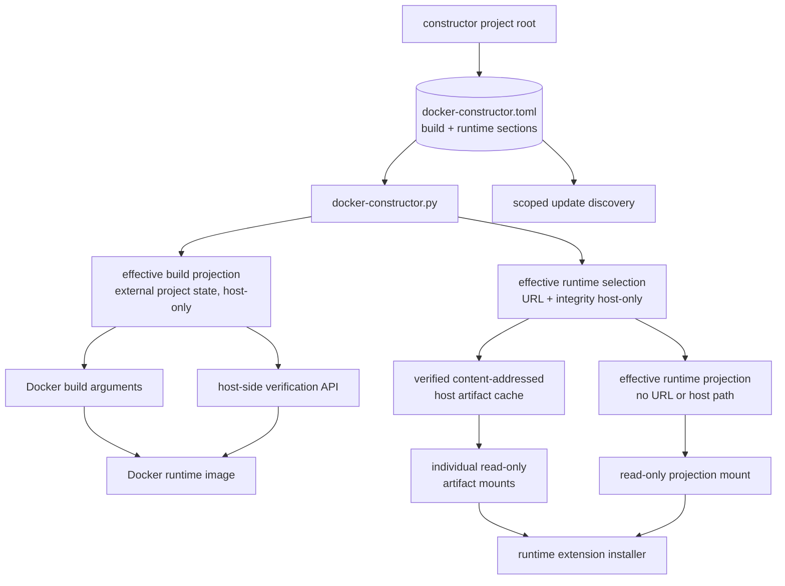

## MODIFIED Requirements

### Requirement: Use a central version inventory
Each selected constructor project SHALL maintain `docker-constructor.toml` directly beneath its project root as the single reviewed dependency source with explicit, closed `build` and `runtime` sections. Every independently selected dependency SHALL be represented in exactly one section by a complete typed source entry. The resolver SHALL apply phase-owned overrides and derive separate effective build and runtime projections beneath the external namespace identified by the canonical path of that constructor project. Runtime artifact URLs SHALL remain host-only materialization inputs; only the narrow effective runtime projection and individually selected read-only artifact blobs may enter a running container.

The target dependency and configuration graph SHALL remain:

#### Scenario: Validating the reviewed inventory locally
- **WHEN** `docker-constructor.py validate` runs for a selected constructor project
- **THEN** it SHALL validate build, runtime, or both source scopes as requested without Docker or network access
- **AND** it SHALL apply closed typed schemas and semantic rules appropriate to each installation phase
- **AND** it SHALL reject unknown, misspelled, duplicated-across-scope, and phase-inappropriate entries

#### Scenario: Discovering the authoritative inventory
- **WHEN** any facade command selects a constructor project from CWD or `--project-directory`
- **THEN** it SHALL use exactly `docker-constructor.toml` directly beneath that project root
- **AND** it SHALL NOT accept `--inventory`, alternate basenames, separate phase source files, parent discovery, or installation-root fallback

#### Scenario: Using an explicit custom inventory
- **WHEN** a caller attempts to select an inventory with the removed `--inventory` option
- **THEN** parsing SHALL reject the option
- **AND** SHALL require selecting the containing constructor project through CWD or `--project-directory`

#### Scenario: Describing uv-managed Python
- **WHEN** the build section declares the selected CPython runtime
- **THEN** its source and update metadata SHALL use the dedicated `uv-python` type/provider and identify the `cpython` implementation
- **AND** update discovery SHALL use the authoritative interpreter release data consumed by uv rather than modeling CPython as a PyPI package

#### Scenario: Describing a Python package tool
- **WHEN** the build section declares the selected `ty` version
- **THEN** it SHALL include a PyPI source containing package identity and a compatible PyPI update provider
- **AND** the validated in-memory build model SHALL retain the complete `ty` entry

#### Scenario: Describing runtime npm extensions
- **WHEN** the runtime section declares a selected Pi extension
- **THEN** its reviewed source entry SHALL contain package, selected default version, a reviewed artifact catalog keyed by exact version, update, override, and validation metadata required by host and runtime workflows
- **AND** every catalog entry SHALL contain the exact artifact URL and integrity for its version key
- **AND** the selected default version SHALL have a matching catalog entry
- **AND** host selection SHALL retain only the selected URL and integrity needed for materialization
- **AND** its effective runtime DTO SHALL identify only the selected mounted artifact and integrity while omitting URL, host path, unselected catalog entries, and host-only update and override metadata

#### Scenario: Building with default selections
- **WHEN** the canonical build command runs without overrides
- **THEN** it SHALL pass values derived from the selected project's build section to Docker
- **AND** it SHALL keep the reviewed source in the selected constructor project and the effective build projection beneath the external namespace identified by the selected constructor project's canonical path
- **AND** it SHALL NOT require runtime artifact materialization for image correctness

#### Scenario: Building with a supported override
- **WHEN** a supported build override such as a stable Python `X.Y.Z >= 3.14.6` is requested
- **THEN** the facade SHALL validate it against policy from the reviewed build section
- **AND** it SHALL apply it only to the host-side effective build projection
- **AND** it SHALL NOT expose that projection to the runtime container

#### Scenario: Generating effective build configuration
- **WHEN** effective Docker construction inputs are rendered with default paths
- **THEN** the build projection SHALL be written atomically beneath the selected constructor project's verified external generated-state namespace
- **AND** the runtime image SHALL NOT expose that file

#### Scenario: Preparing runtime dependency configuration
- **WHEN** a runtime container is launched with default selections or supported runtime overrides
- **THEN** default resolution SHALL select the reviewed artifact catalog entry whose exact version key matches the selected default version
- **AND** override resolution SHALL validate the requested version against reviewed policy and select only the catalog entry with that exact version key
- **AND** an override with no matching reviewed catalog entry SHALL be rejected before materialization without network discovery, URL synthesis, or reuse of another version's integrity
- **AND** the host SHALL derive a canonical content identity and deterministic cache location only from the selected validated integrity
- **AND** it SHALL materialize and verify each selected blob before Docker execution
- **AND** the resolver SHALL generate a closed effective runtime projection containing only effective package identity, version, canonical mounted-artifact identity, checksum/integrity, and validation metadata beneath the external namespace identified by the canonical selected constructor-project path
- **AND** it SHALL mount that projection read-only at `/run/pi-cli/docker-constructor.runtime.toml`
- **AND** it SHALL mount only the selected verified blobs as individual read-only files beneath `/run/pi-cli/runtime-artifacts`
- **AND** neither downloadable URLs, host cache paths, the reviewed source, nor an effective build projection SHALL be copied or mounted into the container

#### Scenario: Looking up a runtime projection for verification
- **WHEN** `verify` runs without `--runtime-projection`
- **THEN** it SHALL use the default runtime-projection lookup beneath the external namespace identified by the canonical selected constructor-project path
- **AND** when `verify --runtime-projection PATH` is supplied, it SHALL instead read exactly the caller-directed `PATH`, including when `PATH` is outside the selected constructor project
- **AND** the explicit path SHALL NOT change runtime projection creation paths, the constructor-project root, or any other project-owned path

#### Scenario: Sharing identical artifact content
- **WHEN** multiple selected runtime entries declare the same validated integrity identity
- **THEN** host materialization SHALL use one content-addressed cache blob and one container file mount
- **AND** each runtime projection entry SHALL reference that same canonical mounted identity without duplicating bytes

## REMOVED Requirements

### Requirement: Separate image builds from runtime project selection
**Reason**: Runtime source inputs are now named workspaces, and the replacement requirement removes ambiguity with the constructor project directory.

**Migration**: Use the replacement “Separate image builds from runtime workspace selection” requirement and `WORKSPACE_PATH_*` terminology.

## ADDED Requirements

### Requirement: Separate image builds from runtime workspace selection
The canonical direct Docker image-build operation SHALL resolve versioned build inputs without requiring runtime-only workspace paths, generated fragments, host bind-mount configuration, host gateway reachability, or operational gateway state.

#### Scenario: Building without runtime configuration
- **WHEN** a user runs `docker-constructor build` with no dotenv file or `WORKSPACE_PATH_*`
- **THEN** the resolver SHALL build the tagged Pi runtime image using the validated build section of the selected project's `docker-constructor.toml`
- **AND** SHALL NOT probe `host.docker.internal`, require a reachable host gateway, read or write `HOST_GATEWAY_IP`, or mutate `.env`
- **AND** SHALL NOT require a real host workspace directory merely to evaluate the build

#### Scenario: Preserving required version inputs
- **WHEN** the direct Docker build command is rendered
- **THEN** all version and artifact arguments SHALL come from the validated effective build projection
- **AND** missing version inputs SHALL NOT gain concrete Dockerfile or Python fallbacks
