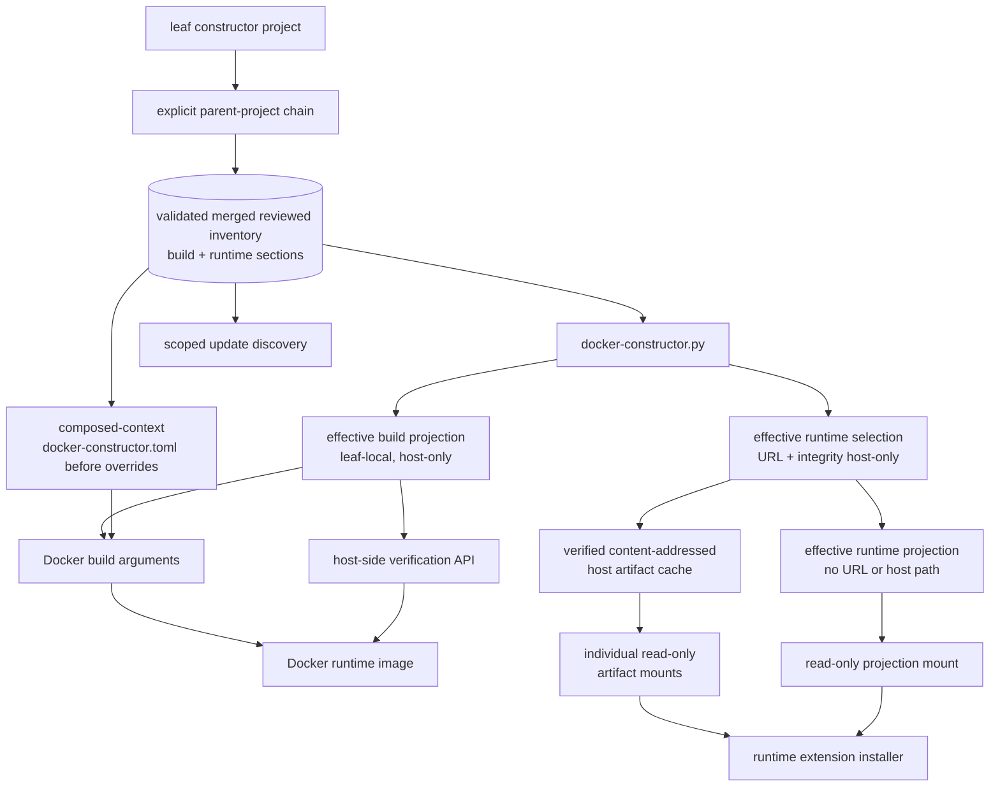

## MODIFIED Requirements

### Requirement: Use a central version inventory
A standalone selected constructor project SHALL maintain `docker-constructor.toml` directly beneath its root as its single authoritative reviewed dependency source. A parented project SHALL use the validated disjoint merge of the selected leaf inventory and every explicitly referenced parent inventory as its single authoritative reviewed dependency source. Both forms SHALL expose explicit, closed `build` and `runtime` sections after validation, and every independently selected dependency SHALL be represented in exactly one section by one complete typed source entry. The resolver SHALL apply phase-owned overrides only after reviewed parent composition and SHALL derive separate effective build and runtime projections beneath the selected leaf `.docker-generated/` directory. Runtime artifact URLs SHALL remain host-only materialization inputs; only the narrow effective runtime projection and individually selected read-only artifact blobs may enter a running container.

The target dependency and configuration graph SHALL remain:

#### Scenario: Validating a standalone reviewed inventory locally
- **WHEN** `docker-constructor.py validate` runs for a selected constructor project without `parent-project`
- **THEN** it SHALL treat that project's `docker-constructor.toml` as the authoritative reviewed inventory
- **AND** SHALL validate build, runtime, or both source scopes as requested without Docker or network access
- **AND** SHALL apply closed typed schemas and semantic rules appropriate to each installation phase
- **AND** SHALL reject unknown, misspelled, duplicated-across-scope, and phase-inappropriate entries

#### Scenario: Validating a parented reviewed inventory locally
- **WHEN** `docker-constructor.py validate` runs for a selected constructor project with an explicit parent chain
- **THEN** it SHALL treat the validated disjoint merged reviewed inventory as authoritative
- **AND** SHALL validate the terminal base and every accumulated effective prefix
- **AND** SHALL validate Docker controls and inherited asset manifests without Docker, network access, or generated output

#### Scenario: Discovering the authoritative inventory
- **WHEN** any facade command selects a constructor project from CWD or `--project-directory`
- **THEN** it SHALL begin with exactly `docker-constructor.toml` directly beneath that leaf project root
- **AND** SHALL follow only valid explicit `parent-project` references from reviewed inventories
- **AND** SHALL NOT accept `--inventory`, alternate basenames, separate phase source files, implicit ancestor discovery, or installation-root fallback

#### Scenario: Describing uv-managed Python
- **WHEN** the merged or standalone build section declares the selected CPython runtime
- **THEN** its source and update metadata SHALL use the dedicated `uv-python` type/provider and identify the `cpython` implementation
- **AND** update discovery SHALL use the authoritative interpreter release data consumed by uv rather than modeling CPython as a PyPI package

#### Scenario: Describing a Python package tool
- **WHEN** the merged or standalone build section declares the selected `ty` version
- **THEN** its source entry SHALL contain package identity and a compatible PyPI update provider
- **AND** the validated in-memory build model SHALL retain the complete `ty` entry

#### Scenario: Describing runtime npm extensions
- **WHEN** the merged or standalone runtime section declares a selected Pi extension
- **THEN** its reviewed source entry SHALL contain package, selected default version, a reviewed artifact catalog keyed by exact version, update, override, and validation metadata required by host and runtime workflows
- **AND** every catalog entry SHALL contain the exact artifact URL and integrity for its version key
- **AND** the selected default version SHALL have a matching catalog entry
- **AND** host selection SHALL retain only the selected URL and integrity needed for materialization
- **AND** its effective runtime DTO SHALL identify only the selected mounted artifact and integrity while omitting URL, host path, unselected catalog entries, and host-only update and override metadata

#### Scenario: Building with default selections
- **WHEN** the canonical build command runs without overrides
- **THEN** it SHALL pass values derived from the authoritative standalone or merged build section to Docker
- **AND** it SHALL materialize the authoritative reviewed mapping before overrides as `docker-constructor.toml` in the private composed context
- **AND** it SHALL keep the effective build projection on the host beneath the selected leaf
- **AND** it SHALL NOT require runtime artifact materialization for image correctness

#### Scenario: Building with a supported override
- **WHEN** a supported build override such as a stable Python `X.Y.Z >= 3.14.6` is requested
- **THEN** the facade SHALL validate it against policy from the authoritative standalone or merged reviewed build section
- **AND** it SHALL apply it only to the host-side effective build projection and Docker arguments
- **AND** it SHALL NOT alter the materialized merged reviewed inventory or expose the effective projection to the runtime container

#### Scenario: Generating effective build configuration
- **WHEN** effective Docker construction inputs are rendered with default paths
- **THEN** the build projection SHALL be written atomically to `<leaf-project-directory>/.docker-generated/docker-constructor.build.effective.toml`
- **AND** the runtime image SHALL NOT expose that file

#### Scenario: Preparing runtime dependency configuration
- **WHEN** a runtime container is launched with default selections or supported runtime overrides
- **THEN** default resolution SHALL select the reviewed artifact catalog entry whose exact version key matches the selected default version
- **AND** override resolution SHALL validate the requested version against merged or standalone reviewed policy and select only the catalog entry with that exact version key
- **AND** an override with no matching reviewed catalog entry SHALL be rejected before materialization without network discovery, URL synthesis, or reuse of another version's integrity
- **AND** the host SHALL derive a canonical content identity and deterministic cache location only from the selected validated integrity
- **AND** it SHALL materialize and verify each selected blob before Docker execution
- **AND** the resolver SHALL generate a closed effective runtime projection containing only effective package identity, version, canonical mounted-artifact identity, checksum/integrity, and validation metadata beneath the selected leaf `.docker-generated/` directory
- **AND** it SHALL mount that projection read-only at `/run/pi-cli/docker-constructor.runtime.toml`
- **AND** it SHALL mount only the selected verified blobs as individual read-only files beneath `/run/pi-cli/runtime-artifacts`
- **AND** neither downloadable URLs, host cache paths, the reviewed source, nor an effective build projection SHALL be copied or mounted into the container

#### Scenario: Looking up a runtime projection for verification
- **WHEN** `verify` runs without `--runtime-projection`
- **THEN** it SHALL use the default runtime-projection lookup beneath the selected leaf `.docker-generated/` directory
- **AND** when `verify --runtime-projection PATH` is supplied, it SHALL instead read exactly the caller-directed `PATH`, including when `PATH` is outside the selected constructor project
- **AND** the explicit path SHALL NOT change runtime projection creation paths, the leaf constructor-project root, parent-chain resolution, or any other project-owned path

#### Scenario: Sharing identical artifact content
- **WHEN** multiple selected runtime entries declare the same validated integrity identity
- **THEN** host materialization SHALL use one content-addressed cache blob and one container file mount
- **AND** each runtime projection entry SHALL reference that same canonical mounted identity without duplicating bytes

## ADDED Requirements

### Requirement: Build from a deterministic composed project context
The canonical build SHALL use the private composed context resolved from the selected leaf and its explicit parent-project chain rather than any source project directory directly. The context SHALL contain the validated merged reviewed inventory before overrides, the selected nearest-child Docker controls, collision-free inherited `docker-assets/`, and leaf-only `.docker-assets-local/`. Docker build arguments and host-only effective projections SHALL continue to carry validated CLI overrides independently of that merged inventory.

#### Scenario: Build a parented project
- **WHEN** canonical build selects a valid leaf with one or more parent projects
- **THEN** the rendered Docker command SHALL use the private composed directory as its sole build context
- **AND** SHALL use the selected nearest-child Dockerfile in that context
- **AND** the context inventory SHALL represent the reviewed parent-chain union before overrides

#### Scenario: Render a complete composed dry-run vector without publication
- **WHEN** canonical build runs with `--dry-run` for a valid standalone or parented project
- **THEN** it SHALL render the complete planned Docker build vector using the in-memory planned private context path
- **AND** SHALL NOT materialize that context, acquire the build lock, perform stale cleanup, publish an effective projection, invoke Docker, or mutate filesystem state

#### Scenario: Preserve cache identity for equivalent reviewed inputs
- **WHEN** two parent chains resolve to identical merged inventory content, Docker controls, reviewed assets, and leaf-local assets
- **THEN** their composed context contents and permission metadata SHALL be equivalent regardless of lexical parent references or source formatting

#### Scenario: Keep project roots outside the Docker context
- **WHEN** build composes one or more project layers
- **THEN** Docker SHALL not receive a source project root, parent local state, or unrelated project files as an additional or merged external context

### Requirement: Preserve reviewed and effective configuration boundaries under inheritance
Parent composition SHALL occur before existing phase-owned override validation and effective build/runtime derivation. Update discovery, display, build planning, runtime selection, and verification SHALL consume the validated merged reviewed inventory, while machine-local companions remain leaf-only. The constructor SHALL NOT mutate parent or child source inventories while resolving, validating, displaying, or building them.

#### Scenario: Apply an inherited override policy
- **WHEN** a parent owns an override policy and the leaf build supplies a permitted override
- **THEN** the constructor SHALL validate that override against the inherited policy
- **AND** SHALL apply it only to the appropriate effective projection and build argument

#### Scenario: Discover updates from merged reviewed sources
- **WHEN** dependency source and update metadata are distributed across disjoint parent layers
- **THEN** update discovery SHALL inspect the merged reviewed inventory
- **AND** SHALL retain its existing no-mutation behavior for every source layer

#### Scenario: Keep default generated outputs leaf-owned
- **WHEN** a parented command publishes effective projections, locks, private contexts, or evidence without an explicit evidence output directory
- **THEN** those outputs SHALL remain beneath the selected leaf `.docker-generated/`
- **AND** no parent directory SHALL receive an implicit generated output from the child command

#### Scenario: Preserve a caller-directed evidence output directory
- **WHEN** a parented evidence command supplies an explicit `--output-dir PATH`
- **THEN** evidence SHALL be written to exactly `PATH`, including when it is outside the selected leaf
- **AND** that redirection SHALL NOT change the resolved parent chain, leaf constructor-project root, projection paths, lock path, private-context root, local companion, or local asset paths
