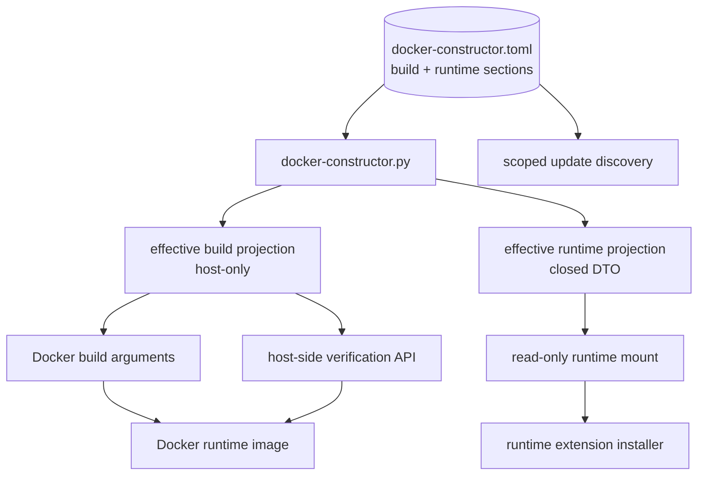

## MODIFIED Requirements

### Requirement: Use a central version inventory
The project SHALL maintain `docker-constructor.toml` as the single reviewed dependency source with explicit, closed `build` and `runtime` sections. Every independently selected dependency SHALL be represented in exactly one section by a complete typed source entry. The resolver SHALL apply phase-owned overrides and derive separate effective build and runtime projections; only the narrow effective runtime projection may enter a running container.

The target dependency and configuration graph SHALL remain:

#### Scenario: Validating the reviewed inventory locally
- **WHEN** `docker-constructor.py validate` runs
- **THEN** it SHALL validate build, runtime, or both source scopes as requested without Docker or network access
- **AND** it SHALL apply closed typed schemas and semantic rules appropriate to each installation phase
- **AND** it SHALL reject unknown, misspelled, duplicated-across-scope, and phase-inappropriate entries

#### Scenario: Discovering the authoritative inventory
- **WHEN** a facade command runs without an explicit `--inventory` path
- **THEN** it SHALL discover `docker-constructor.toml` from the repository root
- **AND** it SHALL NOT discover separate phase source files

#### Scenario: Using an explicit custom inventory
- **WHEN** a caller supplies `--inventory <path>`
- **THEN** the facade SHALL validate and use that TOML file regardless of basename
- **AND** it SHALL require the same explicit build/runtime section structure

#### Scenario: Describing uv-managed Python
- **WHEN** the build section declares the selected CPython runtime
- **THEN** its source and update metadata SHALL use the dedicated `uv-python` type/provider and identify the `cpython` implementation
- **AND** update discovery SHALL use the authoritative interpreter release data consumed by uv rather than modeling CPython as a PyPI package

#### Scenario: Describing a Python package tool
- **WHEN** the build section declares the selected `ty` version
- **THEN** it SHALL include a PyPI source containing package identity and a compatible PyPI update provider
- **AND** the validated in-memory build model SHALL retain the complete `ty` entry

#### Scenario: Describing runtime npm extensions
- **WHEN** the runtime section declares a selected Pi extension
- **THEN** its reviewed source entry SHALL contain package, version, artifact/integrity, update, override, and validation metadata required by host and runtime workflows
- **AND** its effective runtime DTO SHALL omit host-only update and override metadata

#### Scenario: Building with default selections
- **WHEN** the canonical build command runs without overrides
- **THEN** it SHALL pass values derived from the build section to the Docker build
- **AND** it SHALL keep the reviewed source and effective build projection on the host

#### Scenario: Building with a supported override
- **WHEN** a supported build override such as a stable Python `X.Y.Z >= 3.14.6` is requested
- **THEN** the facade SHALL validate it against policy from the reviewed build section
- **AND** it SHALL apply it only to the host-side effective build projection
- **AND** it SHALL NOT expose that projection to the runtime container

#### Scenario: Generating effective build configuration
- **WHEN** effective Docker construction inputs are rendered with default paths
- **THEN** the build projection SHALL be written atomically to `.docker-generated/docker-constructor.build.effective.toml`
- **AND** the runtime image SHALL NOT expose that file

#### Scenario: Preparing runtime dependency configuration
- **WHEN** a runtime container is launched with default selections or supported runtime overrides
- **THEN** the resolver SHALL generate a closed effective runtime projection containing only effective package identity, version, artifact identity, checksum/integrity, and validation metadata
- **AND** it SHALL mount that projection read-only at `/run/pi-cli/docker-constructor.runtime.toml`
- **AND** neither `docker-constructor.toml` nor an effective build projection SHALL be copied or mounted into the container

### Requirement: Prohibit duplicated version defaults
The `build` and `runtime` sections of `docker-constructor.toml` SHALL be the only sources of their respective selected versions, revisions, artifact URLs, digests, and integrity metadata. Dockerfile, direct Docker command rendering, verification, extension setup, environment templates, and documentation SHALL NOT define independent concrete fallback values.

#### Scenario: Resolving a canonical Docker build
- **WHEN** `./docker/docker-constructor.py build` launches a build
- **THEN** it SHALL supply every required Docker build argument from the validated effective build projection
- **AND** it SHALL invoke `docker build` without concrete script-local version defaults

#### Scenario: Invoking Docker without resolved versions
- **WHEN** a repository-owned low-level Docker build path is invoked without validated resolved build values
- **THEN** it SHALL fail with an actionable instruction to use the constructor facade
- **AND** it SHALL NOT silently fall back to hard-coded versions

#### Scenario: Keeping build dependency knowledge on the host
- **WHEN** a runtime image is assembled or launched
- **THEN** neither `docker-constructor.toml` nor an effective build projection SHALL be copied into the image or mounted in the container
- **AND** build-only versions, artifact URLs, checksums, provider metadata, and override policy SHALL remain unavailable as configuration files inside the runtime container

#### Scenario: Verifying build-installed tools
- **WHEN** verification checks tools installed during image build
- **THEN** internal host-side verification APIs SHALL compare container observations with host-side effective build expectations
- **AND** they SHALL NOT provide the reviewed source or effective build projection to the container

### Requirement: Separate image builds from runtime project selection
The canonical direct Docker image-build operation SHALL resolve versioned build inputs without requiring runtime-only project paths, generated fragments, or host bind-mount configuration.

#### Scenario: Building without runtime configuration
- **WHEN** a user runs `./docker/docker-constructor.py build` with no dotenv file or `PROJECT_PATH_*`
- **THEN** the resolver SHALL build the tagged Pi runtime image using the validated build section of `docker-constructor.toml`
- **AND** SHALL NOT require a real host project directory merely to evaluate the build

#### Scenario: Preserving required version inputs
- **WHEN** the direct Docker build command is rendered
- **THEN** all version and artifact arguments SHALL come from the validated effective build projection
- **AND** missing version inputs SHALL NOT gain concrete Dockerfile or Python fallbacks
