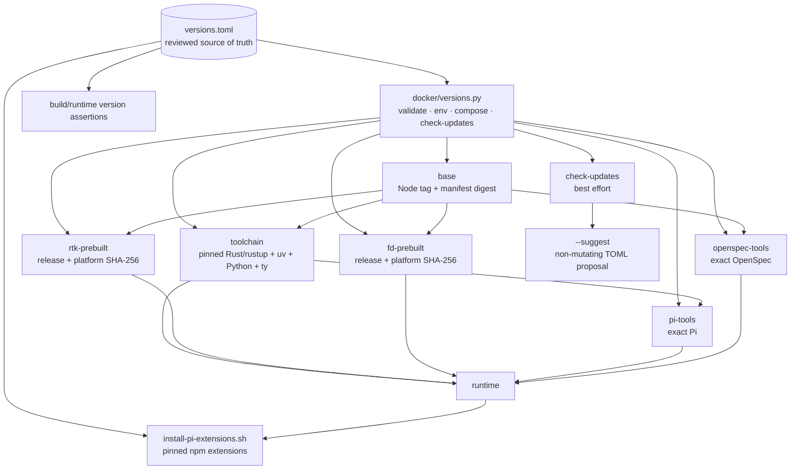
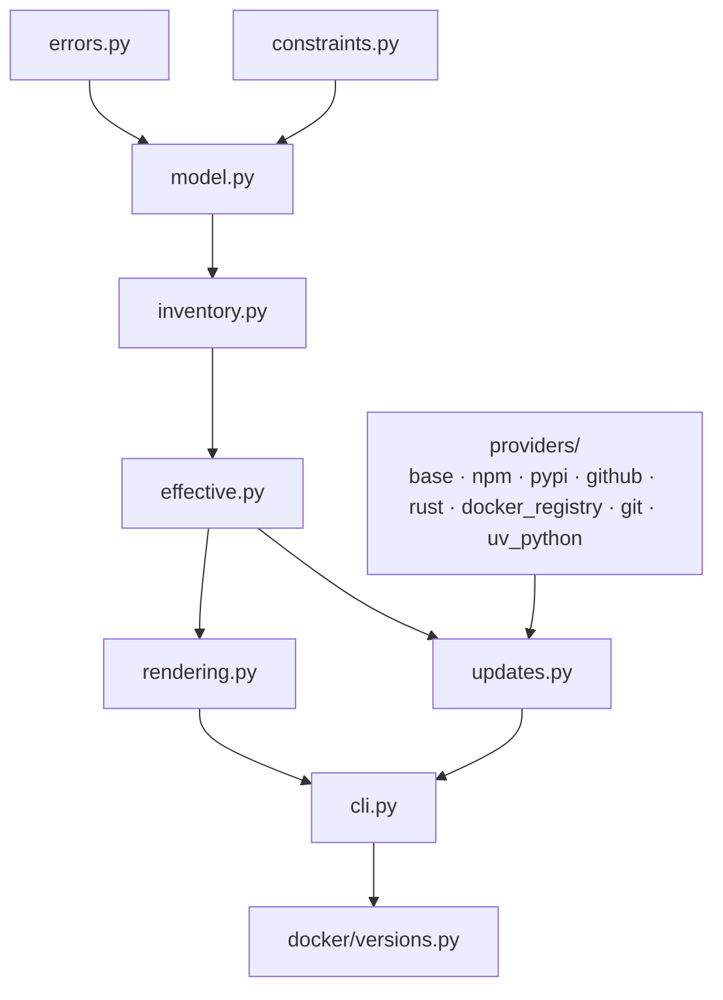

# Capability: docker-build-reproducibility

## Purpose
Define reviewed non-Debian version inventory, reproducible effective build configuration, controlled overrides, and explicit update discovery for the Docker image.

## Requirements

### Requirement: Use a central version inventory
The project SHALL maintain `versions.toml` as the reviewed source of default non-Debian tool versions, immutable revisions, artifact URLs, platform digests, and update-provider metadata. Every independently selected version or revision SHALL be represented by a complete typed entry with explicit source and update metadata. Effective Docker build arguments and runtime inventory SHALL be derived from the same validated configuration.

The target dependency and configuration graph SHALL remain:



#### Scenario: Validating the inventory locally
- **WHEN** `python3 docker/versions.py validate` runs
- **THEN** it SHALL validate required sections, version syntax, digests, platform artifacts, URL/version consistency, source/update metadata, provider-specific field types, source/provider compatibility, and supported Python policy without network access
- **AND** SHALL report actionable configuration errors
- **AND** SHALL reject or report unknown and misspelled entry paths rather than resolving them through catch-all access

#### Scenario: Describing uv-managed Python
- **WHEN** the inventory declares the selected CPython runtime
- **THEN** its source and update metadata SHALL use the dedicated `uv-python` type/provider and identify the `cpython` implementation
- **AND** update discovery SHALL use the authoritative interpreter release data consumed by uv rather than modeling CPython as a PyPI package

#### Scenario: Describing a Python package tool
- **WHEN** the inventory declares the selected `ty` version
- **THEN** it SHALL include a PyPI source containing package identity and a compatible PyPI update provider
- **AND** the validated in-memory toolchain SHALL retain the complete `ty` entry

#### Scenario: Describing runtime npm extensions
- **WHEN** the inventory declares a selected Pi extension
- **THEN** the entry SHALL include an npm source containing package identity and a compatible npm update provider
- **AND** package identity SHALL NOT be duplicated in a separate entry-level field

#### Scenario: Building with default selections
- **WHEN** the canonical Compose build command runs without overrides
- **THEN** it SHALL pass values derived from `versions.toml` to the Docker build
- **AND** SHALL make the same effective values inspectable in the runtime image

#### Scenario: Building with a supported override
- **WHEN** a supported override such as a stable Python `X.Y.Z >= 3.14.6` is requested
- **THEN** the resolver SHALL validate it against the entry's `override.constraint` and `allow_prerelease` policy from `versions.toml`
- **AND** SHALL apply it to the effective configuration
- **AND** the runtime inventory SHALL report the effective value rather than the default

### Requirement: Validate overrides with a restricted constraint grammar
Overrideable entries SHALL keep an exact default `version` separate from an `override` policy. The resolver SHALL implement a dependency-free restricted grammar rather than embedding tool-specific minimum versions in code.

#### Scenario: Evaluating a valid constraint
- **WHEN** an override policy contains comma-separated `==`, `>`, `>=`, `<`, or `<=` clauses with complete numeric `X.Y.Z` operands
- **THEN** the resolver SHALL evaluate all clauses as a logical AND
- **AND** SHALL accept an override only when every clause and prerelease policy is satisfied

#### Scenario: Rejecting unsupported constraint syntax
- **WHEN** a constraint contains an unsupported operator, wildcard, OR expression, omitted version component, empty clause, or contradictory bounds
- **THEN** inventory validation SHALL fail with an actionable error

#### Scenario: Keeping the normal build exact
- **WHEN** no override is requested
- **THEN** the build SHALL select the exact `version` value
- **AND** SHALL NOT resolve the newest version matching `override.constraint`

### Requirement: Prohibit duplicated version defaults
`versions.toml` SHALL be the only source of selected default versions, revisions, artifact URLs, and digests. Dockerfile, Compose, runtime verification, extension setup, environment templates, and documentation SHALL NOT define independent concrete fallback values.

#### Scenario: Resolving a canonical Compose build
- **WHEN** `python3 docker/versions.py compose` launches a build
- **THEN** it SHALL supply all required build arguments from the validated effective inventory
- **AND** `docker-compose.yml` SHALL contain required argument declarations without concrete version defaults

#### Scenario: Invoking Compose without resolved versions
- **WHEN** low-level Docker Compose is invoked without the required resolved version environment
- **THEN** configuration evaluation SHALL fail with an actionable instruction to use the version resolver
- **AND** SHALL NOT silently fall back to hard-coded versions

#### Scenario: Consuming versions at runtime
- **WHEN** runtime verification or Pi extension setup needs an expected version
- **THEN** it SHALL read the root-owned effective inventory
- **AND** SHALL NOT use a script-local fallback version

### Requirement: Preserve authoritative focused pins
The central inventory SHALL incorporate the selected `rtk`/`fd` prebuilt artifacts from `split-rtk-fd-prebuilt` and Pi extension npm versions from `pin-pi-read-npm` without replacing their established installation workflows.

#### Scenario: Resolving focused dependency values
- **WHEN** effective build and runtime configuration is generated
- **THEN** it SHALL include `rtk`/`fd` versions, platform URLs, and SHA-256 digests
- **AND** SHALL include pinned Pi extension package versions

### Requirement: Keep resolver responsibilities modular
The stable `docker/versions.py` executable SHALL remain a thin entry point and delegate to focused standard-library modules under `docker/versioning/`. The target module dependency flow SHALL remain:



The target production file layout SHALL be:

```text
docker/versions.py
docker/versioning/
├── errors.py
├── constraints.py
├── model.py
├── inventory.py
├── effective.py
├── rendering.py
├── updates.py
├── cli.py
└── providers/
    ├── base.py
    ├── npm.py
    ├── pypi.py
    ├── github.py
    ├── rust.py
    ├── docker_registry.py
    ├── git.py
    └── uv_python.py
```

Responsibilities SHALL remain separated as follows:

- `errors.py`: shared configuration and CLI exception types plus dot-path diagnostics;
- `constraints.py`: numeric versions, restricted constraint parsing, matching, and contradiction detection;
- `model.py`: frozen typed inventory, source, update, artifact, and update-result values;
- `inventory.py`: TOML loading, provider-specific schema validation, cross-field validation, and deterministic traversal;
- `effective.py`: override application and deterministic effective-inventory serialization;
- `rendering.py`: Docker/Compose environment and generated build-input rendering;
- `providers/`: independently testable network adapters behind a shared transport/result protocol;
- `updates.py`: provider dispatch, stable-policy filtering, applicability classification, and non-mutating suggestions;
- `cli.py`: argument parsing, output selection, exit-code mapping, and explicit process orchestration.

Dependencies between these modules SHALL remain acyclic. Domain modules SHALL NOT import the CLI, invoke Docker implicitly, or perform provider requests during ordinary inventory operations.

The corresponding unit and subprocess test decomposition SHALL be:

```text
tests/
├── test_version_constraints.py
├── test_version_inventory.py
├── test_version_effective.py
├── test_version_rendering.py
├── test_version_updates.py
├── test_versions_cli.py
└── versioning/
    ├── providers/
    └── support/
```

Provider-specific tests SHALL live under `tests/versioning/providers/`. Shared TOML builders, fixtures, and fake HTTP transports SHALL live under `tests/versioning/support/`. Tests SHALL import the module that owns the behavior rather than using the CLI wrapper for domain-level assertions. Semantic-source tests and Docker acceptance tests SHALL remain separate integration suites.

#### Scenario: Executing the stable command path
- **WHEN** a user runs `python3 docker/versions.py <command>`
- **THEN** the thin entry point SHALL delegate argument handling to the CLI module
- **AND** domain modules SHALL NOT parse process arguments or invoke Docker implicitly

#### Scenario: Testing provider behavior
- **WHEN** update discovery is tested
- **THEN** each provider adapter SHALL be testable independently with deterministic fake responses from an injected transport
- **AND** shared update policy and applicability behavior SHALL be tested separately from transport-specific parsing

#### Scenario: Testing domain behavior
- **WHEN** constraints, inventory validation, effective configuration, or rendering are tested
- **THEN** tests SHALL import the owning module directly
- **AND** SHALL NOT require subprocess execution, Docker, or network access

#### Scenario: Preserving import boundaries
- **WHEN** the resolver is executed directly or imported as package code
- **THEN** both paths SHALL use the same implementation modules without mutating `sys.path`
- **AND** the module dependency graph SHALL remain acyclic

### Requirement: Discover dependency updates explicitly
The version helper SHALL provide an explicit best-effort `check-updates` operation, including the dedicated `uv-python` provider for uv-managed CPython. Normal builds, launches, validation, and runtime setup SHALL NOT invoke update-provider APIs.

#### Scenario: Checking for stable updates
- **WHEN** `python3 docker/versions.py check-updates` runs
- **THEN** it SHALL query each configured provider for stable candidates
- **AND** SHALL report current, outdated, skipped, unavailable, or incomplete status per dependency
- **AND** default execution SHALL not fail solely because an update exists or a provider is unavailable

#### Scenario: Checking release applicability
- **WHEN** a provider reports a newer prebuilt release
- **THEN** the helper SHALL verify required architecture assets and checksum metadata are available before marking it directly applicable

#### Scenario: Distinguishing a base digest refresh
- **WHEN** the selected Docker base tag resolves to a different manifest digest
- **THEN** the helper SHALL report a digest refresh separately from a major or channel upgrade

### Requirement: Suggest reviewed updates without mutation
The version helper SHALL provide `check-updates --suggest` output containing reviewable candidate TOML values and SHALL NOT modify repository files.

#### Scenario: Printing an applicable suggestion
- **WHEN** a newer applicable release has a version, required artifact, and published digest
- **THEN** `--suggest` SHALL print the candidate version, URL, and digest in a reviewable form
- **AND** SHALL leave `versions.toml` and the working tree unchanged

#### Scenario: Encountering an incomplete release
- **WHEN** a newer release lacks a required artifact or checksum
- **THEN** the helper SHALL describe the missing data
- **AND** SHALL NOT present it as an immediately applicable update

### Requirement: Provide a directly executable version resolver
The project SHALL expose `docker/versions.py` as a directly executable user-facing command while retaining interpreter-based and package-import compatibility.

#### Scenario: Invoking the resolver directly
- **WHEN** a user runs `./docker/versions.py <command>` on a supported Unix host
- **THEN** the operating system SHALL execute the resolver through its declared Python interpreter
- **AND** arguments, stdout, stderr, and exit codes SHALL match `python3 docker/versions.py <command>`

#### Scenario: Inspecting the command file
- **WHEN** repository file metadata and the first line of `docker/versions.py` are inspected
- **THEN** the file SHALL have executable permission in Git
- **AND** SHALL begin with a portable Python 3 shebang

#### Scenario: Importing the resolver wrapper
- **WHEN** tests or package code import `docker.versions`
- **THEN** imports SHALL continue to delegate to the same implementation without executing the command entry point
